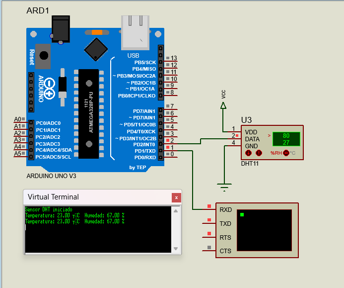
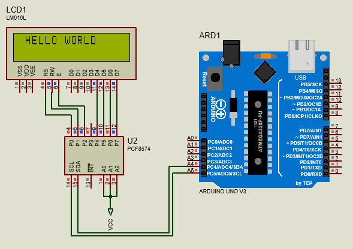

# Sensor DHT11 / DHT22 – Lectura de Temperatura y Humedad

Este código utiliza la librería **DHT sensor library** para leer datos de temperatura y humedad desde sensores DHT11 o DHT22.

## 📦 Librería utilizada

- **Nombre:** DHT sensor library  
- **Autor:** Adafruit  
- **Repositorio oficial:** [https://github.com/adafruit/DHT-sensor-library](https://www.arduinolibraries.info/libraries/dht-sensor-library)

## ⚙️ Métodos principales del objeto `DHT`

| Método                  | Descripción                                                                 |
|-------------------------|------------------------------------------------------------------------------|
| `begin()`               | Inicializa el sensor. Se llama en `setup()`.                                |
| `read(force = false)`   | Realiza una lectura del sensor. Si `force = true`, fuerza la lectura.       |
| `readTemperature()`     | Devuelve la temperatura en °C o °F.                                         |
| `readHumidity()`        | Devuelve la humedad relativa en %.                                          |
| `computeHeatIndex()`    | Calcula el índice de calor según temperatura y humedad.                     |
| `convertCtoF()`         | Convierte grados Celsius a Fahrenheit.                                      |
| `convertFtoC()`         | Convierte grados Fahrenheit a Celsius.                                      |

## 🧪 Notas

- Se recomienda validar los datos con `isnan()` para evitar lecturas corruptas.
- Compatible con sensores DHT11 y DHT22 (definidos por macro `TIPO_DHT`).
## 🧪 Diagrama de conexión – Sensor DHT11 con Arduino Uno

Este ejemplo muestra cómo conectar un sensor DHT11 al pin digital 2 de un Arduino Uno. El sensor proporciona lecturas de temperatura y humedad que se visualizan en el monitor serial.

---
# Pantalla LCD I2C – Visualización de datos con interfaz PCF8574

Este código utiliza la librería **LiquidCrystal_I2C** para controlar pantallas LCD (como 16x2 o 20x4) mediante el protocolo I2C, usando el chip expansor **PCF8574**. Esto permite reducir el número de pines utilizados en el microcontrolador, facilitando la integración con otros sensores y módulos.

En el ejmplo también incluye la librería **Wire.h**, que es esencial para establecer la comunicación I2C entre el microcontrolador y el chip **PCF8574**. `Wire.h` proporciona las funciones necesarias para iniciar el bus I2C, enviar y recibir datos, y sincronizar correctamente los dispositivos conectados. Sin esta librería, la interfaz I2C no puede operar, ya que `LiquidCrystal_I2C` depende internamente de `Wire` para transmitir comandos al LCD.

## 📦 Librería utilizada

- **Nombre:** LiquidCrystal_I2C  
- **Autor:** marcoschwartz (basada en el trabajo de johnrickman)  
- **Repositorio oficial:** [https://github.com/johnrickman/LiquidCrystal_I2C](https://www.arduinolibraries.info/libraries/liquid-crystal-i2-c)

## ⚙️ Métodos principales del objeto `LiquidCrystal_I2C`

| Método                    | Descripción                                                                 |
|---------------------------|------------------------------------------------------------------------------|
| `begin()`                 | Inicializa la pantalla LCD. Se llama en `setup()`.                          |
| `backlight()`             | Enciende la luz de fondo del LCD.                                           |
| `noBacklight()`           | Apaga la luz de fondo del LCD.                                              |
| `setCursor(col, row)`     | Posiciona el cursor en la columna y fila especificada.                      |
| `print("texto")`          | Imprime texto en pantalla desde la posición actual del cursor.              |
| `clear()`                 | Borra todo el contenido de la pantalla.                                     |
| `home()`                  | Mueve el cursor a la posición inicial (0,0).                                |
| `cursor()`                | Muestra el cursor en pantalla.                                              |
| `noCursor()`              | Oculta el cursor.                                                           |
| `blink()`                 | Activa el parpadeo del cursor.                                              |
| `noBlink()`               | Desactiva el parpadeo del cursor.                                           |
| `createChar(num, byte[])`| Crea un carácter personalizado (hasta 8 disponibles).                       |
| `write(byte)`             | Escribe directamente un byte en pantalla (útil para íconos o caracteres especiales). |

## 🧪 Notas

- Se recomienda detectar la dirección I2C del módulo con un escáner antes de inicializar (`0x27` y `0x3F` son comunes).
- Compatible con pantallas LCD basadas en el controlador HD44780.
- Puede integrarse fácilmente en simuladores como Proteus usando el módulo PCF8574.
## 🧪 Diagrama de conexión – LCD I2C con Arduino Uno

Este ejemplo muestra cómo conectar el modulo PCF8574 I2C con arduino uno.

---